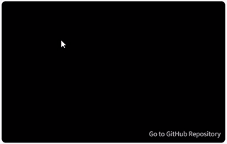

# Overview

The threejs_delaunay project is a gravity simulator of planetary system made with [Three.js](https://threejs.org/) .  
This project is also the Three.js version of [m5core2_delaunay](https://github.com/cubic9com/m5core2_delaunay) .

\[日本語\]

threejs_delaunay プロジェクトは、 [Three.js](https://threejs.org/) 製のインタラクティブにドロネー図を描画するソフトウェアです。  
またこのプロジェクトは [m5core2_delaunay](https://github.com/cubic9com/m5core2_delaunay) のThree.js版です。

# Video



# How to Use

1. Open [this page](https://cubic9com.github.io/threejs_delaunay/) with browser.

\[日本語\]

1. [このページ](https://cubic9com.github.io/threejs_delaunay/) をブラウザで開きます。

# Installation for developers

1. Clone the repository:
    ```sh
    git clone https://github.com/cubic9com/threejs_delaunay.git
    cd threejs_delaunay
    ```

2. Open the project in Visual Studio Code:
    ```sh
    code .
    ```

\[日本語\]

1. リポジトリをクローンします:
    ```sh
    git clone https://github.com/cubic9com/threejs_delaunay.git
    cd threejs_delaunay
    ```

2. Visual Studio Code でプロジェクトを開きます:
    ```sh
    code .
    ```

# License

Copyright (C) 2025, cubic9com All rights reserved.

This project is licensed under the MIT license.

See file `LICENSE` file for details.

